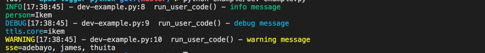

Overview
=======
This library allows standard python logging to output log data as json objects and cosole messages. The JSON objects are more machine readable and thus can be ported to stack driver and bugsnag while the console messages have been formated to be more human readable with a capability to add details to them.

Installing
==========
Pip:

    pip install https://github.com/andela/epic-logger-python/archive/v1.0.0.tar.gz
This will install v1.0.0 of the epic-logger python library

**Please note: the version v1.0.0  may keep changing, please update the version on the pip install feature to the latest release inorder to benefit from latest additions.**

Usage
=====

## Integrating with Python's logging framework

The logger displays logs of different levels in different colors on the console. The logs levels are info, warning, error and critical. It also logs messages in json format when the environment is production or staging.

### Log Methods
As stated above, the epic logger provides various methods to log different kinds of errors:

- `log.debug()` used for debuging like when you want to print out a message. It is quite noisy and is only recommended for development environment. Epic logger prints these kind of logs in blue.
- `log.info()` Used when logging information, this could be things like major entry and exit points on a system. Epic logger prints these kind of logs in green.
- `log.warning()` Used when logging handled exceptions in your apllication. Epic logger prints these kind of logs in yellow.
- `log.error()` Used to log unhandled exceptions in your application. It should thus be used in the `except` block. Epic logger prints these kind of logs in red.
- `log.critical` Just like `log.error()` it is used in except to handle unhandled exceptions that are of high magnitude. A review is necessary to discuss whether an error qualifies to be classified as critical. Epic logger prints these kind of logs in bold red.

For the `log.error()` and `log.critical()` methods, a variable `exec_info=true` has to be passed inorder for the methods to print out the error and how it got triggered (`exec_info` is short for excution_information). Check out the code snippets below for examples.

### Examples 

#### 1. Log info/debug/warning on dev env:


```python
import sys
from epic_logger import getLogger

logger = getLogger(__name__)

def run_user_code(log):
    log.info('info message', extra={'person': 'Ikem'})
    log.debug('debug message', extra={ 'ttls': { 'core': 'ikem'}})
    log.warning('warning message', extra={ 'sse': ['adebayo', 'james', 'thuita'] })

run_user_code(logger)
```
running the above code snippet will give us this output:

**note: the comand for running on dev is: `python <your-file.py>`**



You can see that the logger logs the log level, the time, the file, the function, the line number, and the message, in that order. You can add an extra bit of information by adding an argument in the `extra` dictionary.

#### 2. Log error and critical on dev env:

```python
import sys
from epic_logger import getLogger
from datetime import datetime

logger = getLogger(__name__)

def run_user_code(log):
    try:
        i = 1/0
    except:
        print("Exception in user code:")
        print('-'*60)
        log.error('error message', exc_info=True, extra={ 'user': 'ikem' , 'my_time': datetime.utcnow().isoformat()})
        log.critical('critical message', exc_info=True, extra={ 'user': 'ikem' , 'my_time': datetime.utcnow().isoformat()})
        print('-'*60)

run_user_code(logger)
```
Running the above code outputs:


As it is evident above, the error/ critical message appears in different shades of red. The important point to note is that when logging errors and critical messages, the `exec_info` is set to `True` this is to allow for code execution information to appear in the error.

#### 3. Log info/ warning on staging/production env:
**Note: PYENV should be set to prod/staging on the environment**
```python
import sys
from epic_logger import getLogger

logger = getLogger(__name__)

def run_user_code(log):
    log.info('info message', extra={'person': 'Ikem'})
    log.warning('warning message', extra={ 'sse': ['adebayo', 'james', 'thuita'] })

run_user_code(logger)
```
running the above code snippet will give us this output:


As you can see, the errors warning/infos are logged as json

#### 4. Log error and critical on staging/prod env:

Remember `PY_ENV` should be set to prod or staging

```python
import sys
from epic_logger import getLogger
from datetime import datetime

logger = getLogger(__name__)

def run_user_code(log):
    try:
        i = 1/0
    except:
        print("Exception in user code:")
        print('-'*60)
        log.error('error message', exc_info=True, extra={ 'user': 'ikem' , 'my_time': datetime.utcnow().isoformat()})
        log.critical('critical message', exc_info=True, extra={ 'user': 'ikem' , 'my_time': datetime.utcnow().isoformat()})
        print('-'*60)

run_user_code(logger)
```
Running the code gives us this output:


Again, the logs appear as json the notable point being the `exec_info` is set to `True` to allow logging execution info.

## Customizing fields
You can also add extra fields to your json output by specifying a dict in place of message, as well as by specifying an `extra={}` argument. An example is how datetime is added in our code snippet examples.

A valuable field to pass is the `'ctx': context` field. This one should always be passed in the extra variable for all log methods. The `ctx` argument is used to get the metadata from a log. It should always be passed unless we do not have any context to pass at the time of logging.

## Testing

To test the logging:

Run:
- `PY_ENV=prod python example/my_test.py`  to see appearance on production/staging `<env>` can be `prod`, `staging` or `test`.
- `python example/my-test.py` to see appearance on dev env

`python epiclogger/test.py <env>`

If testing production logging, add a bugsnag API key.
`PY_ENV=prod python example/my-test.py <bugsnag_api_key>`
